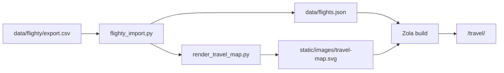

# Travel section

The `/travel/` page shows Flighty-derived flight statistics, a static route map, optional trip notes (blog posts), and a recent-flights table.

## Layout

```
content/travel/
  _index.md          # front matter only; body is a pointer comment (see below)
  *.md               # trip notes → /travel/<slug>/

data/
  flights.json       # committed stats + map geometry (generated)
  airports.json      # IATA → lat/lon/country (for import + map)
  ne_110m_*.geojson  # Natural Earth land + coastline
  flighty/export.csv # gitignored raw Flighty export

scripts/
  flighty_import.py
  render_travel_map.py

static/images/
  travel-map.svg     # generated map (committed)

templates/
  travel.html        # section landing page
  travel-post.html   # individual trip notes
```

## What renders where

`content/travel/_index.md` intentionally has no visible body copy — only an HTML comment pointing here and to `templates/travel.html`. All landing-page content is template-driven:

| Block | Source |
|-------|--------|
| Title | `section.title` from front matter |
| Stats grid + top lists | `data/flights.json` via `load_data`, rendered in `travel.html` |
| Map | `static/images/travel-map.svg` (embedded ``) |
| Trips & notes | child pages under `content/travel/` |
| Recent flights | `flights.json` → `recent` array |

Trip posts use `travel-post.html` and normal Markdown bodies.

## Data flow



## Importing Flighty data

1. Export from Flighty (Profile → Settings → Account Data → Export Your Flights).
2. Save as `data/flighty/export.csv` (gitignored).
3. Run `python3 scripts/flighty_import.py`.

This writes:

- **`data/flights.json`** — stats, top lists, recent flights table, and `map` geometry for the renderer. Seat numbers, PNRs, and notes are excluded from the public JSON.
- **`static/images/travel-map.svg`** — static map image.

Re-run after each new export and commit the updated JSON + SVG.

## Map design

We use a **build-time SVG** rather than a client-side map (Leaflet was tried early on).

| Choice | Rationale |
|--------|-----------|
| Static SVG | No runtime JS or tile CDN; sharp at any zoom; updates on import |
| Web Mercator | Familiar rectangular world map; same family as most web maps |
| Great-circle arcs | Shortest-path routes on the sphere; curves on Mercator |
| Antimeridian split | Routes crossing ±180° are split so lines do not streak across the map |
| View crop 58°S–72°N | Drops Antarctica and empty Arctic; route arcs peak ~64°N in current data |
| Natural Earth 110m | Land fill + coastline strokes (`data/ne_110m_land.geojson`, `data/ne_110m_coastline.geojson`) |

### Antimeridian streaks (fixed)

On a 0°-centered Mercator map, a route like HNL→HND crosses the date line near the top. If ±180° both project to the same x-coordinate, or if a segment jumps from the left edge to the right edge in one SVG path, you get horizontal streaks.

`render_travel_map.py` handles this by:

1. Sampling each route as a **short-path great circle** (3D slerp).
2. **Splitting** polylines when longitude crosses ±180°.
3. Projecting **+180° to the right edge** and **−180° to the left edge** (`project_x`).
4. Breaking any remaining segment where screen **x jumps** more than half the map width.

### Regenerating only the map

```bash
python3 scripts/render_travel_map.py
# reads data/flights.json, writes static/images/travel-map.svg
```

## `flights.json` shape (summary)

```json
{
  "generated_at": "2026-07-13",
  "stats": {
    "flights": 189,
    "airports": 44,
    "countries": 8,
    "miles": 304106,
    "top_routes": [{"route": "YYZ-SFO", "count": 27}],
    "top_airports": [{"airport": "SFO", "count": 139}],
    "top_airlines": [{"airline": "ACA", "count": 50}],
    "top_aircraft": [{"aircraft": "Airbus A320", "count": 31}]
  },
  "map": {
    "airports": [{"code": "SFO", "lat": 37.6, "lon": -122.4, "city": "San Francisco"}],
    "routes": [{"from": "SFO", "to": "YYZ", "lat1": 37.6, "lon1": -122.4, "lat2": 43.7, "lon2": -79.4}]
  },
  "recent": [
    {"date": "2026-04-05", "airline": "UAL", "flight": "1317", "from": "SJC", "to": "ORD", "aircraft": "Airbus A319"}
  ]
}
```

## Adding trip notes

Create `content/travel/my-trip.md`:

```toml
+++
title = "Tokyo, March 2025"
date = 2025-03-15
template = "travel-post.html"
+++

Your markdown here.
```

Posts appear under **Trips & notes** on `/travel/`, above the recent-flights table.

## Privacy defaults

Committed data is intentionally limited: aggregate stats, route endpoints, airline codes, aircraft types, and a 20-flight recent table. Raw CSV stays gitignored.
